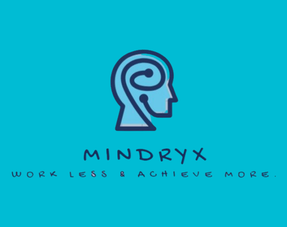
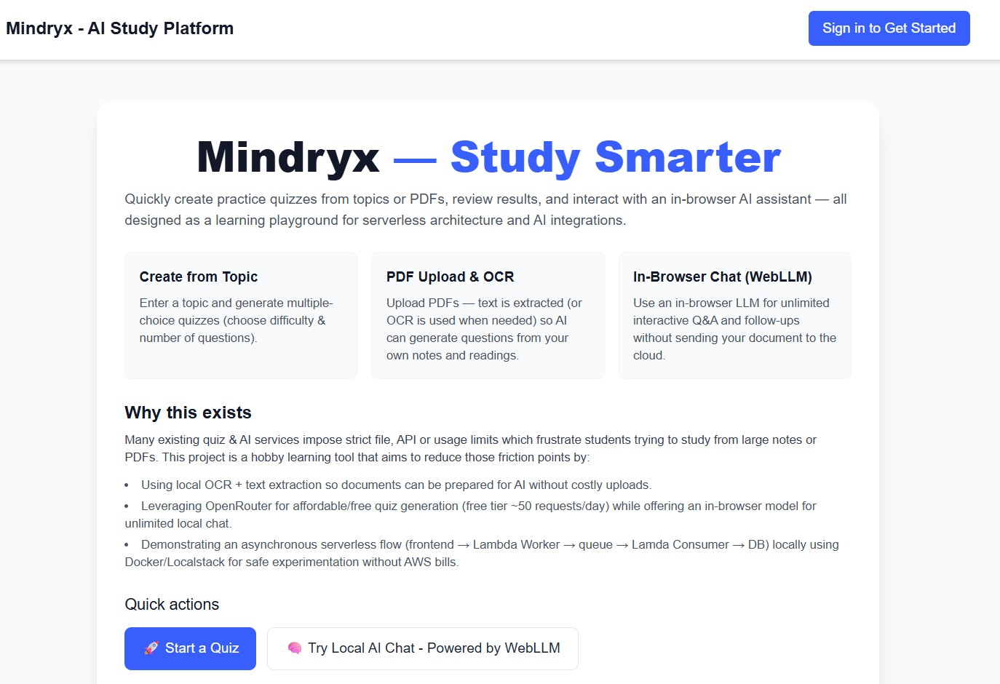
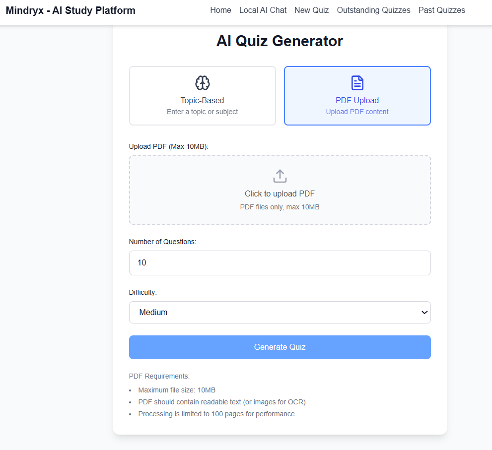
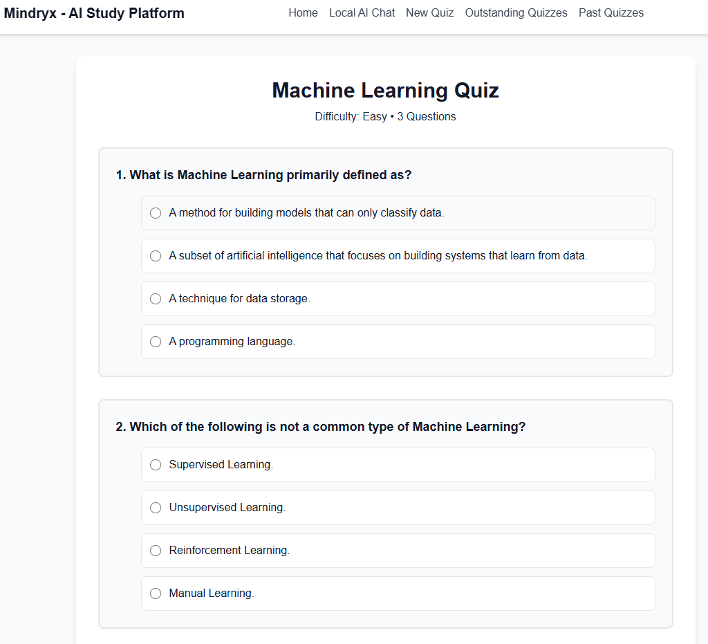
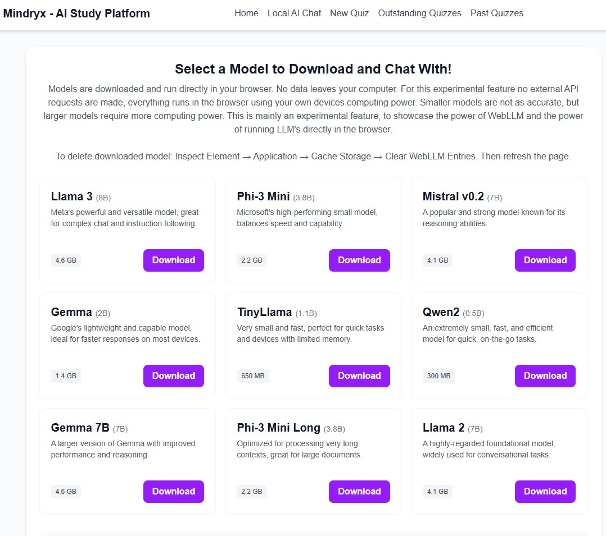
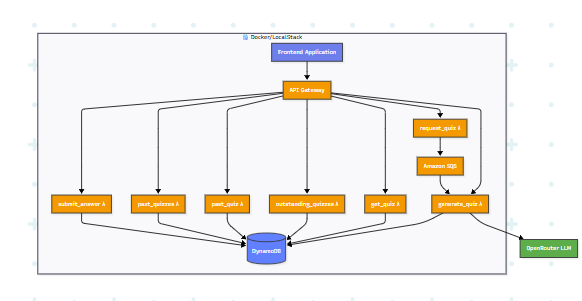

# Mindryx - AI Quiz Generator and Study Platform

<div align="center">



**A serverless quiz generation platform powered by AI**

*Study smarter with dynamically generated quizzes from any topic or PDF*

[](https://nextjs.org/)
[](https://docker.com/)
[](https://localstack.cloud/)
[](LICENSE)

**⚠️ This is the experimental/testing branch - not production ready**

</div>

## 🎯 What is Mindryx?

Mindryx is a **learning-focused quiz and AI study platform** that demonstrates modern serverless architecture patterns while solving real educational challenges. Whether you're studying from textbooks, lecture notes, or exploring new topics, Mindryx transforms your content into engaging multiple-choice quizzes using AI.

**Key Philosophy:** This is a hobby project built for learning serverless design patterns and containerized microservices - allowing safe experimentation with AWS-style architecture without incurring cloud costs.

---

## 🚧 Project Status

**Current Branch: Testing/Experimentation**
- ✅ Fully functional local development environment
- ✅ Complete AWS emulation via LocalStack
- ✅ End-to-end quiz generation and management
- ⚠️ **Not production-ready** - designed for learning and tinkering

**Planned Production Branch:**
- 🎯 **Vercel** deployment with Serverless Functions via **Flask**
- 🗄️ **Supabase** PostgreSQL database
- 🔐 Server-side authentication for API route protection
- 🚀 Production-optimized performance and security

---

## ✨ Features

### 🔥 Core Functionality
- **📝 PDF & Topic-Based Quiz Generation** — Enter any subject and get tailored questions
- **📄 PDF Intelligence** — Upload documents with automatic text extraction and OCR
- **⚡ Async Processing** — Serverless queue system handles generation in the background
- **📊 Progress Tracking** — Review past quizzes and monitor learning progress
- **🔐 Secure Authentication** — Powered by Clerk for seamless user management

### 🧪 Experimental Features
- **🤖 In-Browser AI Chat** — Local LLM running entirely in your browser (WebLLM)
- **📬 Notification System** — SNS integration for quiz completion alerts *(in development)*

---

## Illustrations










---

## 🏗️ Architecture

Mindryx demonstrates **modern serverless arhictecture** using a locally-emulated AWS stack:



**Powered by LocalStack** for cost-free experimentation and rapid development.

---

## 🚀 Quick Start

### Prerequisites

- **Docker Desktop** or **Docker Engine**
- **Node.js** 18+ and **npm**
- **Bash** shell (WSL recommended on Windows)

### 1. Clone and Setup Environment

```bash
git clone https://github.com/humza987/Mindryx.git
cd Mindryx

# Get your OpenRouter API key from https://openrouter.ai (free tier: 50 requests/day)
export OPENROUTER_API_KEY="your_openrouter_key_here"
```

### 2. Initialize Backend Infrastructure

```bash
chmod +x setup.sh
./setup.sh
```

This script will:
- 🐳 Start LocalStack container
- ⚡ Create Lambda functions from `/backend/lambdas/`
- 🗄️ Initialize DynamoDB tables
- 📬 Set up SQS queue for async processing
- 🌐 Configure API Gateway routes

### 3. Configure Frontend

```bash
# Create .env.local with your credentials
cat > .env.local << EOF
NEXT_PUBLIC_API_ID=oh72zg4c5u

# Clerk Authentication (get from https://clerk.com)
NEXT_PUBLIC_CLERK_PUBLISHABLE_KEY=pk_test_...
CLERK_SECRET_KEY=sk_test_...
EOF
```

### 4. Launch Development Server

```bash
npm install
npm run dev
```

Visit **http://localhost:3000** and start creating quizzes!

---

## 🛠️ Tech Stack

<table>
<tr>
<td><strong>Frontend</strong></td>
<td>
• <a href="https://nextjs.org/">Next.js 15</a> with App Router<br>
• <a href="https://tailwindcss.com/">TailwindCSS 4</a> for styling<br>
• <a href="https://clerk.com/">Clerk</a> authentication<br>
• <a href="https://lucide.dev/">Lucide Icons</a><br>
• <a href="https://github.com/naptha/tesseract.js">Tesseract.js</a> + <a href="https://github.com/mozilla/pdf.js">pdfjs-dist</a> for OCR
</td>
</tr>
<tr>
<td><strong>Backend (LocalStack)</strong></td>
<td>
• <strong>AWS Lambda, SQS, DynamoDB, API Gateway</strong> (emulated)<br>
• <strong>Python 3.9</strong> runtime for Lambda functions<br>
• <a href="https://openrouter.ai">OpenRouter API</a> for AI generation<br>
• <a href="https://pypi.org/project/json-repair/">json_repair</a> for robust JSON parsing<br>
• <strong>Docker Compose</strong> for orchestration
</td>
</tr>
<tr>
<td><strong>AI & ML</strong></td>
<td>
• <strong>OpenRouter</strong> (DeepSeek R1 etc...) for quiz generation<br>
• <a href="https://github.com/mlc-ai/web-llm">WebLLM</a> for in-browser chat<br>
• <strong>Tesseract OCR</strong> for document text extraction
</td>
</tr>
</table>

---

## 📋 API Endpoints

Once `setup.sh` completes, your API will be available at:

```
Base URL: http://localhost:4566/restapis/{API_ID}/dev/_user_request_

POST   /quiz                    # Request new quiz generation
GET    /quiz/{quizId}           # Retrieve specific quiz
POST   /submit                  # Submit quiz answers
GET    /past-quizzes            # List completed quizzes
GET    /past-quiz/{quizId}      # Get quiz with results
GET    /outstanding-quizzes     # List pending quizzes
```

### Example Usage

```bash
# Request a quiz
curl -X POST "http://localhost:4566/restapis/oh72zg4c5u/dev/_user_request_/quiz" \
  -H "Content-Type: application/json" \
  -d '{
    "userId": "user_123",
    "topic": "React Hooks",
    "numQuestions": 5,
    "difficulty": "meduim"
  }'
```

---

## 🔀 Branch Strategy

### Testing Branch (Current)
- **Purpose:** Experimentation and learning serverless patterns
- **Infrastructure:** LocalStack + Docker for AWS emulation
- **Database:** DynamoDB (emulated)
- **Deployment:** Local development only

### Production Branch (Planned)
- **Purpose:** Production-ready deployment
- **Frontend:** Vercel deployment
- **Backend:** Vercel Serverless Functions via Flask
- **Database:** Supabase PostgreSQL
- **Authentication:** Server-side API route protection
- **Additional Features:** Enhanced security, monitoring, and performance optimizations

---

## 🤝 Contributing

This is a **learning project** built for educational purposes. Contributions, suggestions, and discussions are very welcome!

### Areas for Improvement
- **Enhanced OCR** — Better handling of complex PDF layouts and tables
- **More AI Models** — Integration with additional LLM providers
- **Mobile Experience** — Responsive design improvements
- **Analytics Dashboard** — Learning progress visualizations
- **Spaced Repetition** — Smart scheduling for optimal retention

### Getting Involved

1. **Fork the repository**
2. **Create a feature branch** (`git checkout -b feature/amazing-feature`)
3. **Make your changes** and test locally with LocalStack
4. **Submit a pull request** with a clear description

---

## 🔮 Roadmap

### Testing Branch Improvements
- [ ] **Enhanced PDF Processing** — Table and diagram recognition
- [ ] **WebLLM Optimization** — Better in-browser AI performance
- [ ] **Queue Management** — Improved SQS job handling
- [ ] **Error Recovery** — Robust failure handling and retry logic

### Production Branch Goals
- [ ] **Vercel + Supabase Migration** — Production-ready deployment
- [ ] **Server-side Authentication** — Secure API route protection
- [ ] **Performance Optimization** — Caching and CDN integration
- [ ] **Collaborative Quizzes** — Share and remix quizzes with others
- [ ] **Export Options** — PDF and Anki deck generation

---

## 📄 License

This initial project is licensed under the **MIT License** — feel free to use, modify, and distribute as you see fit.

---

## 🙏 Acknowledgments

Built with amazing open-source tools:
- **LocalStack** for AWS emulation
- **OpenRouter** for accessible AI APIs
- **Clerk** for authentication
- **Tesseract.js** for OCR capabilities
- **WebLLM** for in-browser AI
- **Next.js** team for the amazing framework

---

<div align="center">

**Made with passion as a learning project**

*Exploring serverless architecture one Lambda at a time*

*Questions? Ideas? Found a bug?*  
[Open an issue](https://github.com/humza987/mindryx/issues)

</div>
